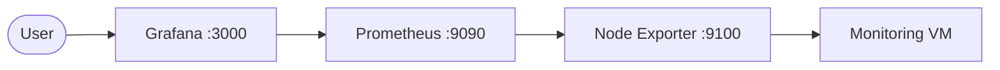

# Scenario 2

## Architecture



## Code

### Playbook & Roles

The `monitoring` Ansible role installs and configures:

* Prometheus
* Grafana
* Node Exporter

It also:

* Configures Prometheus to collect Node Exporter metrics.
* Configures Prometheus as Grafana's datasource.
* Creates a Grafana dashboard for CPU and memory usage.
* Enables and starts all services using `systemd`.

The deployment is executed with:

```bash
ansible-playbook -i inventory main.yml -b --private-key ~/.ssh/id_ed25519_fanap
```

The playbook completed successfully with:

```text
failed=0
```

### Inventory

The monitoring VM is configured in `inventory/inventory/monitoring.yml`:

```yaml
monitoring:
  hosts:
    mon-1:
      ansible_host: 95.38.234.110
      ansible_user: root
```

The required ports are defined in `inventory/group_vars/monitoring.yml`:

```yaml
prometheus_port: 9090
grafana_port: 3000
node_exporter_port: 9100
```

## Credentials / Login

```text
# Grafana
URL: http://95.38.234.110:3000
user: admin
pass: admin123
```

## Verification

The services were verified using:

```bash
curl http://95.38.234.110:9090
curl http://95.38.234.110:9100/metrics
curl http://95.38.234.110:3000/api/health
```

Prometheus, Node Exporter, and Grafana all responded successfully.

Grafana contains a dashboard with:

* CPU Usage
* Memory Usage

## Challenges

* **Grafana GPG key download:** Ansible's `get_url` module failed because of a Python/HTTPS compatibility issue. It was replaced with `wget`, which solved the problem.

* **Prometheus verification:** `curl -I` returned `405 Method Not Allowed` because it sends a `HEAD` request. Using a normal `GET` request confirmed that Prometheus was working.
